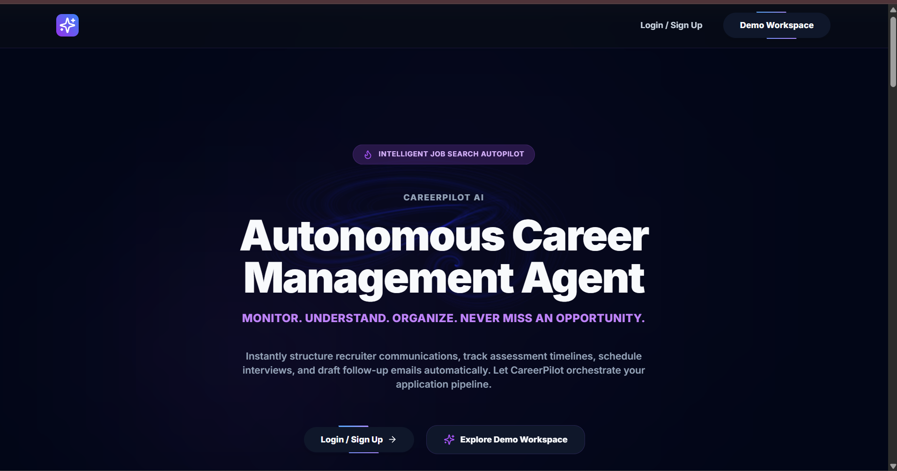
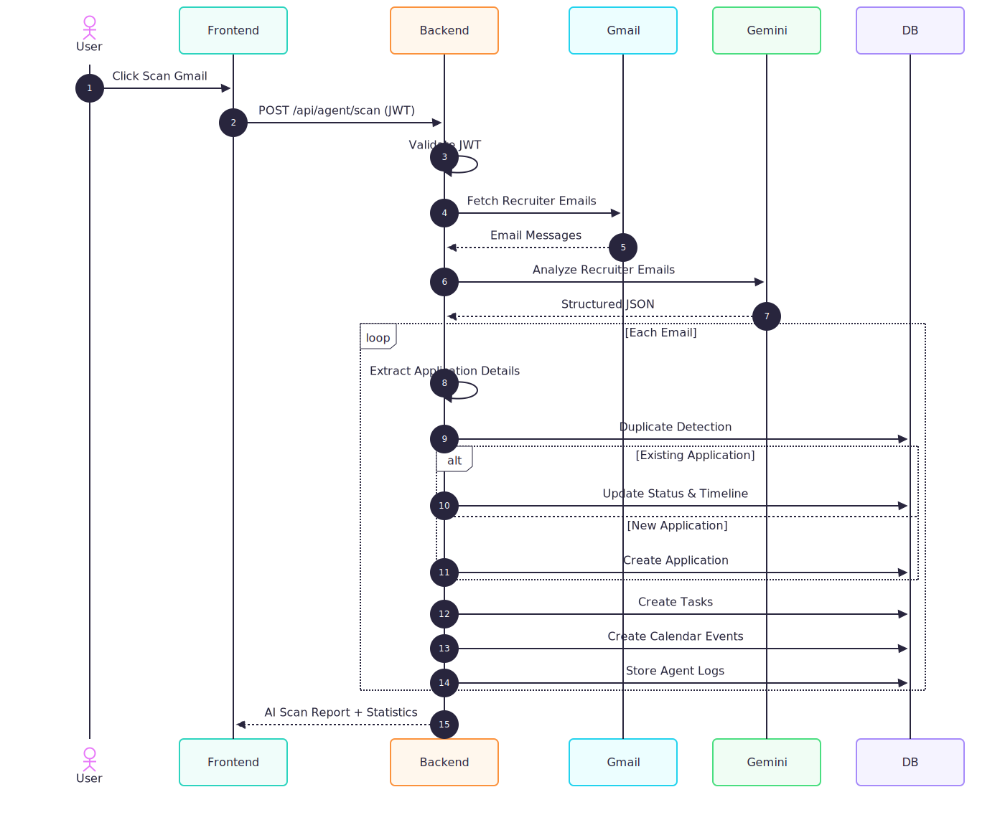
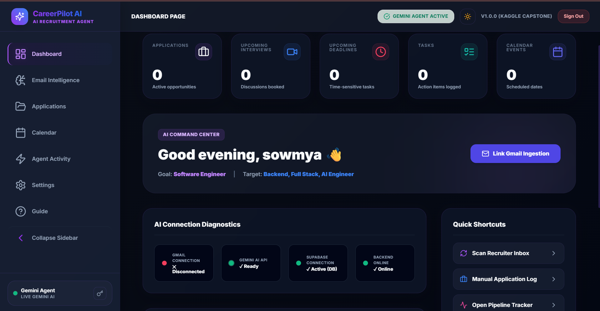
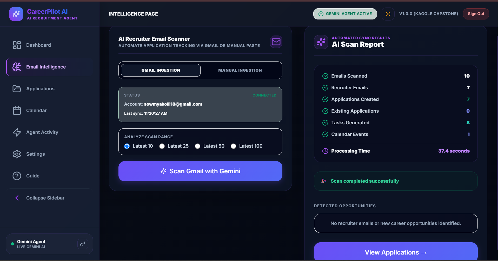
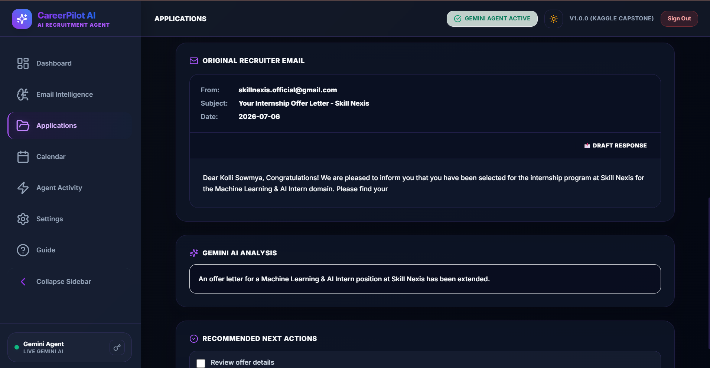
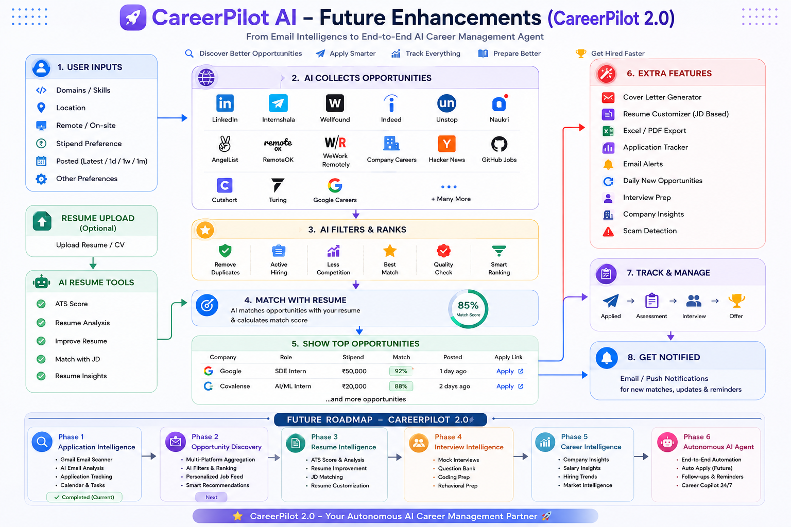

# 🚀 CareerPilot AI

### Autonomous AI Career Management Platform



---

### Badges
[](https://react.dev)
[](https://vitejs.dev)
[](https://typescriptlang.org)
[](https://expressjs.com)
[](https://nodejs.org)
[](https://tailwindcss.com)
[](https://supabase.com)
[](https://ai.google.dev)
[](https://developers.google.com/identity)
[](LICENSE)

---

## 📝 Project Overview

CareerPilot AI is an autonomous, multi-agent workspace platform designed to streamline job search organization. The platform connects securely with a candidate's Gmail inbox to automatically detect recruiter updates, schedule interview events, draft contextual email follow-ups, and organize application milestones on an interactive Kanban board and timeline.

---

## ⚠️ The Problem

Managing a modern job search is chaotic. Candidates balance dozens of applications across multiple channels:
- Important recruiter updates get lost in promotional spam.
- HackerRank coding tests and take-home assignments sit unnoticed in the inbox.
- Interviews are missed because calendar links are buried in deep email threads.
- Copy-pasting data manually into spreadsheets is time-consuming and prone to errors.

---

## 💡 The Solution

CareerPilot AI orchestrates the job search automatically by combining the Gmail API with the Google Gemini AI model:
- **Automatic Monitoring**: Identifies and acts on new job opportunities.
- **AI Extraction**: Pulls roles, companies, dates, and next steps out of unstructured text.
- **Unified Command Center**: Presents application milestones, calendar invites, and preparation tasks on a central dashboard.

---

## ✨ Key Features

- **Google OAuth Login**: Authentic connection with Google APIs, securely isolating credential operations on the backend server.
- **JWT Session Security**: Session tokens protect REST endpoints without database overhead.
- **Gmail API Ingestion**: Scans user inboxes automatically for career-related emails.
- **Gemini AI Classification**: Classifies recruiter emails into standardized stages (`Applied`, `Assessment`, `Interview`, `Offer`, `Rejected`) with confidence scores.
- **Automatic Application Tracking**: Inserts new job tracker cards automatically.
- **Interactive Timelines**: Traces consecutive updates inside application detail drawers.
- **Milestones Calendar**: Synchronizes interview rounds and test deadlines to a unified layout.
- **Preparation Checklists**: Generates next-step preparation checklists dynamically.
- **AI Scan Report**: Measures and displays execution times and database update statistics.
- **Demo Workspace**: Visitors can explore the core dashboard and features instantly without authentication.
- **Responsive Theme Engine**: Supports a custom cursor-trail canvas background in light and dark modes.

---

## 🛠️ Technology Stack

| Component | Technology | Description |
| :--- | :--- | :--- |
| **Frontend** | React (SPA), Vite, TypeScript | User interface runtime |
| **Styling** | Tailwind CSS, Framer Motion | Styles and animated layout reveals |
| **Backend** | Express.js, Node.js | REST APIs, Google OAuth, and AI pipeline |
| **Database** | PostgreSQL (Supabase) | Structured storage with cascade-delete constraints |
| **AI Integration** | Gemini 2.5 Flash, Gemini 1.5 Flash | Batch classifications and draft replies |
| **Email Integration** | Google Gmail API | Secure token sync |

---

## 📐 Architecture

### High-Level Architecture
The backend maps user JWT claims, refreshes OAuth connections, processes batches of emails with Gemini, and saves application details to Supabase.


### AI Agent Workflow
An Orchestrator Agent routes data between the Gmail Monitor, Classification, Information Extraction, Calendar, Task, and Telemetry Agents.


### Gmail Scan Pipeline
Shows the data flow when a user clicks the sync inbox scanner.


### Database Architecture
Supabase schema mapping users, applications, emails, tasks, calendar events, and audit logs.


### User Journey
User onboarding, connecting Gmail, scanning the inbox, and managing applications.


### AI Intelligence Flow
Shows how recruiter emails are parsed into job opportunities, milestones, and dashboards.


---

## 📸 Screenshots

### 1. Landing Page
Interactive cursor-trail background with product workflow highlights.


### 2. Dashboard Command Center
Displays active pipelines, interview ratios, calendar milestones, and task checklists.


### 3. Email Intelligence Scanner
Scanner view displaying progressive execution checks and AI Scan Reports.


### 4. Application Details Drawer
Chronological timelines, recruiter contact cards, action items, and draft responses.


---

## 📁 Project Structure

```
CareerPilot_advanced/
├── package.json
├── vite.config.ts
├── tailwind.config.js
├── index.html
├── src/                  # FRONTEND
│   ├── main.tsx          # Client entrypoint
│   ├── App.tsx           # Global state manager, route switches, theme toggles
│   ├── index.css         # Styling system base layers
│   │
│   ├── components/       # UI Components
│   │   ├── LandingView.tsx
│   │   ├── DashboardView.tsx
│   │   ├── EmailIntelligenceView.tsx
│   │   ├── TrackerView.tsx
│   │   ├── CalendarView.tsx
│   │   ├── AgentActivityView.tsx
│   │   ├── SettingsView.tsx
│   │   ├── OnboardingFlow.tsx
│   │   ├── Layout.tsx
│   │   ├── HeroBackground.tsx
│   │   └── ui/
│   │       ├── canvas.tsx
│   │       ├── spotlight-card.tsx
│   │       └── button.tsx
│   ├── context/
│   │   └── AppContext.tsx
│   └── lib/
│       └── utils.ts
├── server/               # BACKEND
│   ├── index.js          # REST API & DB connections
│   ├── schema.sql        # Database initialization script
│   └── package.json
└── docs/                 # DOCUMENTATION
    ├── screenshots/
    └── diagrams/
```

---

## 🚀 Installation & Local Execution

### 1. Clone the Repository
```bash
git clone https://github.com/Sowmya-Kolli/CareerPilot_advanced.git
cd CareerPilot_advanced
```

### 2. Install Project Dependencies
Install backend dependencies:
```bash
cd server
npm install
cd ..
```
Install frontend dependencies:
```bash
npm install
```

### 3. Configure Environment Variables
Create a `.env` file in the root directory using the environment variables listed below.

### 4. Run Locally
Start the server and client concurrently:
```bash
npm run dev
```
- **Frontend Dashboard**: [http://localhost:5174](http://localhost:5174)
- **Backend Port**: [http://localhost:5000](http://localhost:5000)

---

## 🔑 Environment Variables

Create a `.env` file in the root folder with the following variables:

```ini
# Backend Server Configuration
PORT=5000

# Supabase PostgreSQL Connection String
DATABASE_URL=your_supabase_postgresql_connection_string

# Google Gemini API Key
GEMINI_API_KEY=your_gemini_api_key

# Google OAuth Credentials (Gmail API Access)
GOOGLE_CLIENT_ID=your_google_client_id
GOOGLE_CLIENT_SECRET=your_google_client_secret
REDIRECT_URI=http://localhost:5174

# JWT Key
JWT_SECRET=your_long_random_jwt_secret_key
```

---

## ## 🔮 Future Roadmap



## 🚀 CareerPilot 2.0 Vision

CareerPilot aims to evolve from an email tracker into an autonomous career agent:
- **Opportunity Discovery**: Auto-scrapes target job boards and matches postings to profile objectives.
- **Resume Intelligence**: Re-writes resumes automatically to match specific job descriptions.
- **Interview Intelligence**: Simulates mock coding interviews and analyzes responses.
- **Career Intelligence**: Predicts compensation metrics and tracks regional salary offers.
- **Autonomous AI Agent**: Follows up with recruiters and schedules interviews automatically.

---


## 🧑‍💻 Developers

### Sowmya Kolli
- GitHub: https://github.com/Sowmya-Kolli
- Portfolio: https://sowmya-kolli-portfolio.vercel.app
- LinkedIn: https://www.linkedin.com/in/sowmya-kolli-785998362/

### Rohit Padala
- GitHub: https://github.com/padalarohit12
- LinkedIn: https://linkedin.com/in/padalarohit12

---

## 📄 License

This project is licensed under the MIT License. See [LICENSE](LICENSE) for details.

---

## 🤝 Acknowledgements

- [Google Gemini API](https://ai.google.dev) for generative classification.
- [Google Gmail API](https://developers.google.com/gmail/api) for secure inbox integrations.
- [Supabase](https://supabase.com) for PostgreSQL hosting.
- [React](https://react.dev) and [Vite](https://vitejs.dev) for frontend development.
- [Tailwind CSS](https://tailwindcss.com) for layout styling.