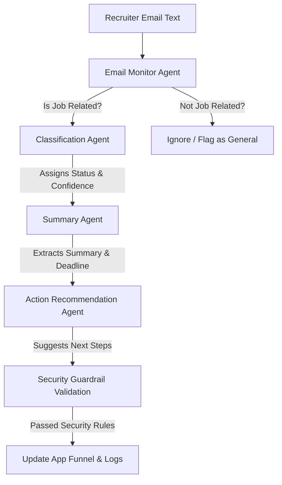

# SPEC.md - HireTrack AI Specification

## Project Goal
HireTrack AI is an autonomous AI-powered job application email tracking agent application designed to monitor job-related emails, understand recruiter correspondence, extract critical application details, and represent the user's career application funnel cleanly on a premium SaaS dashboard.

## Requirements
1. **Multi-Agent Orchestration**: Separate roles for monitoring, status classification, summarization, and action recommendation.
2. **Tools Architecture**: Decoupled tool layer for data fetching, classification, and summarization, prepared for MCP/Gmail APIs.
3. **Agent Skills**: Markdown-based progressive disclosure rules for specific agent tasks.
4. **Security Guardrails**: Rules validation to restrict unauthorized or sensitive operations.
5. **Evaluation Suite**: Embedded validation test sets simulating various email categories.
6. **Premium UI**: Clean, light SaaS layout utilizing indigo/purple accent themes, rounded modern cards, and interactive visualizations.

## Agent Workflow

## Security Rules
1. **Read-Only Permissions**: Under no circumstances can the agent delete recruiter emails.
2. **No Automated Responses**: The agent is restricted from composing or sending replies automatically.
3. **Human-in-the-Loop**: Actions like scheduling, drafts, or email replies require explicit user permission.
4. **Data Privacy**: Redact or ignore highly sensitive non-job credentials (e.g., passwords or social security numbers).
5. **No Hallucination**: If details like deadline or company are not present, return `"Not available"`.
